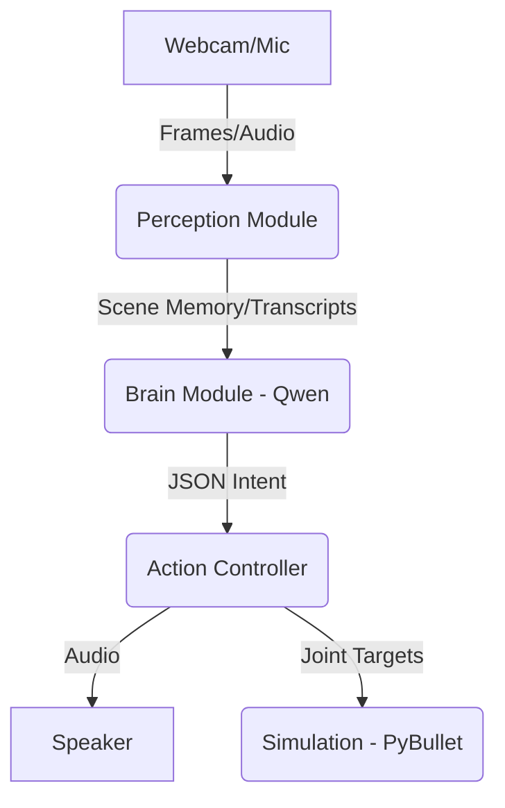

# Submission

## Deliverables

1. **Source code**: Everything is in the root directory (`main.py`, `perception.py`, `brain.py`, `action_controller.py`, `simulation.py`).
2. **Setup and run instructions**: Check out the `README.md`.
3. **Short technical note**: Below!

---

### Architecture and Data Flow

### Key Design Choices

- **Sticking to Local Models**: I really wanted to see if I could fit a full vision/language pipeline into the 8GB RAM constraint without cheating and using paid cloud APIs. I used `Ollama` to run `moondream` (for vision) and `qwen2:0.5b` (for the brain). I originally tried a larger model like phi3, but quickly hit the VM disk space and RAM limits. Qwen2 is incredibly tiny (~350MB) and handles the JSON intent parsing surprisingly well.
- **Simulation**: I went with `PyBullet` because it's super lightweight. Gazebo felt like overkill and usually struggles on a CPU-only setup. PyBullet runs smoothly in the background and loads the URDF easily.
- **Audio/Perception**: I used `Vosk` for offline speech-to-text since it's fast on a CPU. For the camera, I ran into some classic VMware USB passthrough issues during testing, so I added a fallback in the OpenCV script that forces the robot to "wake up" if the camera drops. This way, the audio and logic pipeline can still be tested even if VMware is acting up.
- **Data Flow**: The brain forces the LLM to output a strict JSON payload (`{"speech": "...", "action": "..."}`). The action controller grabs that and maps it to specific joint trajectories.

### Measurements & Tradeoffs

- **Response Latency**: Because I'm running an LLM and a VLM locally on a 4-core CPU, there's a noticeable 1-2 second delay before the robot responds to speech. It's a tradeoff I accepted to keep the project 100% free and offline.
- **CPU & Memory**: The whole stack (PyBullet + Vosk + Ollama models) hovers right around 6.5GB of RAM. Safe, but cutting it close to the 8GB ceiling!

### Known Limitations

- Real-time continuous object tracking would probably melt the CPU, so the vision model only grabs frames when explicitly needed (like when asking about scene memory).
- The animations are hardcoded keyframe trajectories rather than dynamic inverse kinematics.
